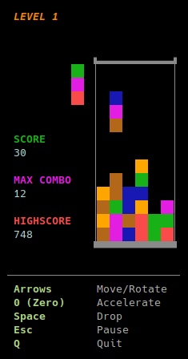

# color-columns-tui

A highly addictive Columns-style puzzle game for the Linux terminal, written in Rust.



## Technical Showcase

This project is a practical showcase focused on tight performance, demonstrating how to build highly efficient software without sacrificing language conveniences. It features:

* **Terminal-Based 2D Gameplay:** Running a complete, interactive 2D game entirely inside a standard terminal window.
* **Minimal Binary Size:** Stripping the compiled executable down as far as possible while retaining the standard Rust library (`std`).
* **Heavy Resource Optimization:** Keeping the game's hardware footprint incredibly low through strict data management:
  * **CPU Usage:** Stays around 0.1% on modern machines, and peaks at just ~0.8% on low-power mobile hardware (tested on an Intel i5-1035G1).
  * **Memory Footprint:** Stays completely flat at a constant ~2.9 MB of RAM due to a zero-heap runtime model.

Despite utilizing the rich features of the `ratatui` and `crossterm` libraries, this application yields an astonishingly small compiled binary footprint of just **453 KiB (463,376 bytes)**.
Achieving this required:
- Aggressive compiler tuning (`opt-level = "z"`, `lto = "fat"`)
- Custom linker flag optimization (`--gc-sections`, `--icf=all`)
- Standard library optimization via `build-std`
- Building with the `nightly-2026-06-11` toolchain
- Shifting away from heavy heap-allocated collections toward fixed-size stack arrays and custom bitmasks to eliminate allocation overhead
- Extensive binary golfing at the code level to minimize overall executable size

---

## Installation

Select the installation that matches your Linux distribution.

### Method 1: APT-based Distributions (GLIBC 2.39+)
Use this method if you are running a modern distribution featuring **GLIBC 2.39 or newer**, including:
* **Ubuntu / Kubuntu / Xubuntu / Lubuntu / MATE / Budgie / Studio** (24.04+)
* **Linux Mint** (22+)
* **Pop!_OS** (24.04+)
* **Zorin OS** (18+)
* **elementary OS** (8+)
* **Kali Linux** (2024.3+)
* **Debian** (13 / Sid)

Run this single command to download the latest `.deb` package, install it via `apt`, and remove the temporary installer file:

```bash
curl -sLO https://github.com/rdrmic/color-columns-tui/releases/download/v1.0.0/color-columns-tui_1.0.0-1_amd64.deb && sudo apt install ./color-columns-tui_1.0.0-1_amd64.deb && rm color-columns-tui_1.0.0-1_amd64.deb
```

### Method 2: Standalone Static Binary (Any Linux Distro / Older Versions)
If you are running an older release (such as Ubuntu 20.04 or 22.04), a non-Debian ecosystem (Arch, Fedora, Alpine, openSUSE), or simply prefer a completely standalone configuration, download the zero-dependency statically linked MUSL binary:

```bash
curl -sL -o cc-tui https://github.com/rdrmic/color-columns-tui/releases/download/v1.0.0/color-columns-tui-linux-x86_64
chmod +x cc-tui
mkdir -p ~/.local/bin
mv cc-tui ~/.local/bin/
```

---

## Running the Game

Once installed via either of the delivery options above, run the game by typing:

```bash
cc-tui
```

---

## Uninstallation

To cleanly remove the executable binary from your machine, run the appropriate sequence:

### For APT / .deb Package Deployments
To completely drop the tracked environment components and system binary mappings:

```bash
sudo apt remove color-columns-tui
```

### For Standalone Static Binary Deployments
To manually strip the loose global binary file from your environment path:

```bash
rm ~/.local/bin/cc-tui
```

---

## Cleaning Up Game Data

The application stores localized runtime states, tracking high scores (`hs`) and engineering output records (`last_run.log`), underneath the standardized user profile storage directory (`~/.local/state/color-columns-tui/`). 

To completely purge all remaining traces of local game history and score profiles, run:

```bash
rm -rf ~/.local/state/color-columns-tui/
```
